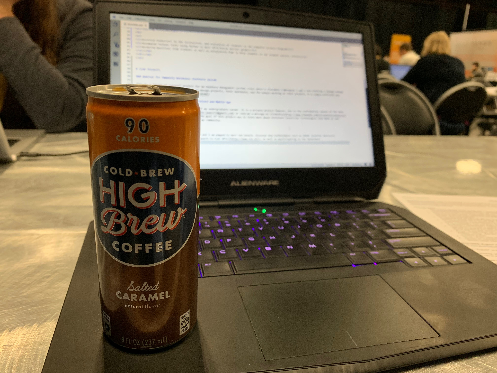

# About Me
Hi, My name is Juan Valencia
I'm currently a part time mobile developer, full time student in East Texas finishing up my last semester for my B.S. in Computer Science. I was born in Medellin, Colombia and am natively fluent in English and Spanish. My goal is to one day architect code that will affect lives in a meaningful way. I am intrigued by big data and machine learning and am trying to learn as much as possible through projects focusing on those topics. I am currently working at [Elliott Electric Supply](https://www.elliottelectric.com/) and can't wait to graduate!

My [Latest Resume](./Resume20181106.pdf)
[Contact Me](mailto:juan7732@gmail.com)
[LinkedIn](https://www.linkedin.com/in/juanruizvalencia/)

Here are a few of the skills I've become experienced with:
* Python
* C# / .NET
* Git
* SQL
* JavaScript
* Xamarin
* HTML & CSS
* C/C++
* Scikit-learn
* Java
* Swift

# Experience
<dl>
<dt>Elliott Electric Supply</dt>
<dd><dl>
<dt>Mobile Software Developer</dt>
<dd>
<ul>
<li>Write modern, cross-platform code for our internal and external facing applications</li>
<li>Use 3rd party APIs to power our apps to do more</li>
<li>Create custom components to increase productivity among the mobile team and empower our apps</li>
<li>Design, Implement, and test .NET APIs to power the back-end of our applications</li>
</ul></dd>
</dl></dd>
<dt>Stephen F. Austin State University</dt>
<dd><dl>
<dt>Teaching Assistant</dt>
<dd>
<ul>
<li>Assisted Professors in the instruction, and evaluation of students in the Computer Science Program</li>
<li>Automated tedious tasks using Python to more efficiently deliver grades</li>
<li>Answered Questions from students as well as volunteered time to help students in our student success centers</li>
</ul></dd>
</dl></dd>
</dl>

# Side Projects

### Habitat for Humanity Warehouse Inventory System

This is a *proof-of-concept* project for my Database Management systems class where a classmate ( @bargeje ) and I are creating a Django webapp that will allow Habitat for Humanity to manage projects, their warehouse, and the people working on their projects in a simple efficient way. [Learn more here](https://juan-valencia.com/HFHWI/)

### Driving Jacks Ride Sharing Infrastructure and Mobile App

This is my biggest project for the end of my undergraduate career. It is a private project however, due to the confidential nature of the data being used. Feel free to [email me](mailto:juan7732@gmail.com) or send me a message on [LinkedIn](https://www.linkedin.com/in/juanruizvalencia/) to discuss the project in more depth. The goal of this project was to learn more about different JavaScript technologies like Node.js and Express.js while providing a service to my community.

# What I do for fun!

Currently, I am at DeveloperWeek Austin and I am pumped to meet new people, discover new technologies such as [HERE location Services](https://www.here.com/en) and [Rev.ai Speech-to-text APIs](https://www.rev.ai/), as well as participating in the hackathon!

Shoutout to [HERE](https://www.here.com/en) for the great coffee!
